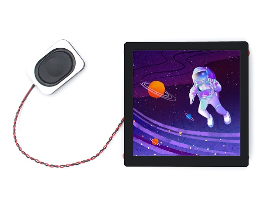
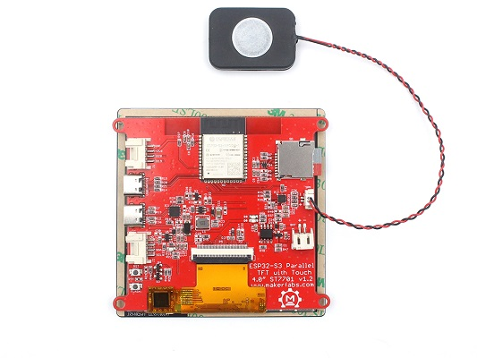
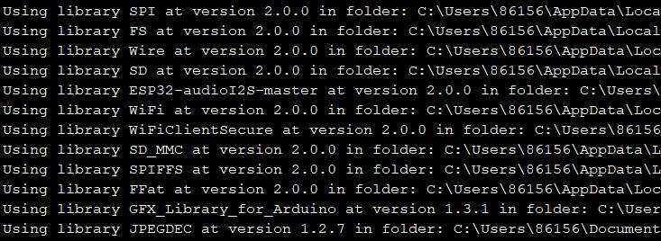

# Makerfabs ESP32-S3 Parallel TFT with Touch 4inch

```c++
/*
Version:        V1.1
Author:            Vincent
Create Date:    2023/2/4
Note:
        V1.2：Now support LovyanGFX！
        V1.1: Add example and update readme.
*/
```

[TOC]



# Makerfabs

[Makerfabs home page](https://www.makerfabs.com/)

[Makerfabs Wiki](https://wiki.makerfabs.com/)

# Makerfabs ESP32-S3 Parallel TFT with Touch 4inch

## Intruduce

Product Link ：[ESP32-S3 Parallel TFT with Touch 4.0" 480*480 ST7701](https://www.makerfabs.com/esp32-s3-parallel-tft-with-touch-4-inch.html)

Wiki Link : [ESP32-S3 Parallel 4.0" TFT with Touch](https://wiki.makerfabs.com/ESP32_S3_Parallel_4.0_TFT_with_Touch.html)

The Latest ESP32-S3 4.0 inch display with 480*480 resolution, it integrated display/ touch/ audio speaker/ Lipo charger, to make this product ideal for applications such as IoT controlling, electronic photo frame, etc.

## Feature

- 4 inch RGB IPS display, it communicates with the controller ESP32S3 with 3SPI+RGB5/6/5 interface, with FPS >80;
- 5 points Touch;
- Onboard 16G SD card for storage;
- Lipo battery socket and charger, support any 3.7v lipo battery;
- On board speaker connector. This product is shipped with a 3 ohm 4w, 3528 speaker, the voice loud and clean, suitable for most applications;
- 2x Onboard Mabee connectors, support multiple Mabee/ Grove modules;



# Code

## Complier Option

- Install board : ESP32 .
- Install libraries：

[ESP32-audioI2S]([GitHub - schreibfaul1/ESP32-audioI2S: Play mp3 files from SD via I2S](https://github.com/schreibfaul1/ESP32-audioI2S))



- Use type-c use cable connect USB-TTL to PC.
- Select "ESP32-S3 DEV Module"
- Select PSRAM "OPI PSRAM"

"mf_Lvgl" library is modified from Lvgl library (version 8.3.2). 

Please unzip "lib/mf_Lvgl.zip" and copy to arduino library directory.

## Factory test program

\example\esp32s3_4.0_tft_fw_test

You can run this file test if you feel that your hardware is not working properly. 

In addition, it is necessary to decompress the compressed package in the sd_file folder and copy all the pictures and music in it to the TF card.

## Attention

Our Arduino_GFX_library version is 1.3.1, while the latest version is 1.3.4. The two versions are incompatible the running code. Our customer@Tim successfully ran the Arduino_gfx_Library version after modifying the configuration in the code on version 1.3.4.


```
Arduino_DataBus *bus = new Arduino_SWSPI(
    GFX_NOT_DEFINED /* DC */, 1 /* CS */,
    12 /* SCK */, 11 /* MOSI */, GFX_NOT_DEFINED /* MISO */);

Arduino_ESP32RGBPanel *rgbpanel = new Arduino_ESP32RGBPanel(
    45 /* DE */, 4 /* VSYNC */, 5 /* HSYNC */, 21 /* PCLK */,
    39 /* R0 */, 40 /* R1 */, 41 /* R2 */, 42 /* R3 */, 2 /* R4 */,
    0 /* G0 */, 9 /* G1 */, 14 /* G2 */, 47 /* G3 */, 48 /* G4 */, 3 /* G5 */,
    6 /* B0 */, 7 /* B1 */, 15 /* B2 */, 16 /* B3 */, 8 /* B4 */,
    1 /* hsync_polarity */, 10 /* hsync_front_porch */, 8 /* hsync_pulse_width */, 50 /* hsync_back_porch */,
    1 /* vsync_polarity */, 10 /* vsync_front_porch */, 8 /* vsync_pulse_width */, 20 /* vsync_back_porch */);

Arduino_RGB_Display *gfx = new Arduino_RGB_Display(
    480 /* width */, 480 /* height */, rgbpanel, 0 /* rotation */, true /* auto_flush */,
    bus, GFX_NOT_DEFINED /* RST */, st7701_type1_init_operations, sizeof(st7701_type1_init_operations));
```
